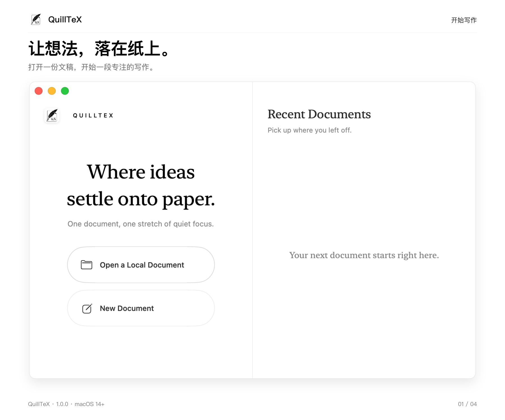
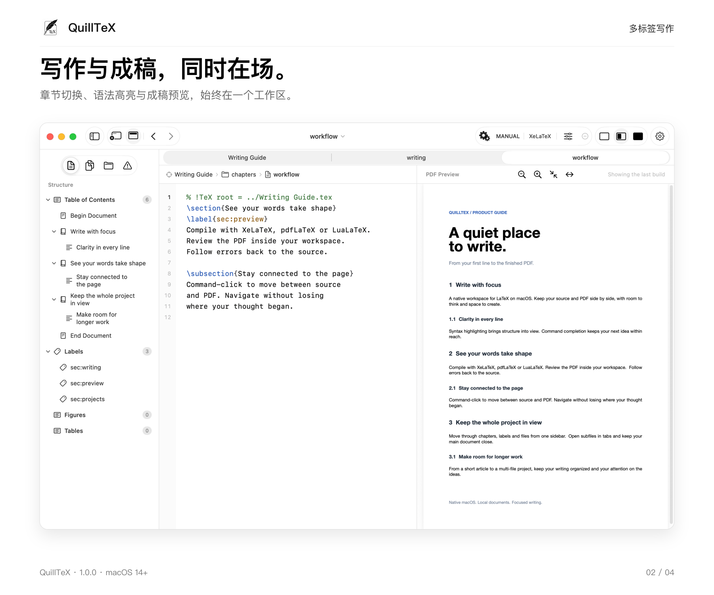
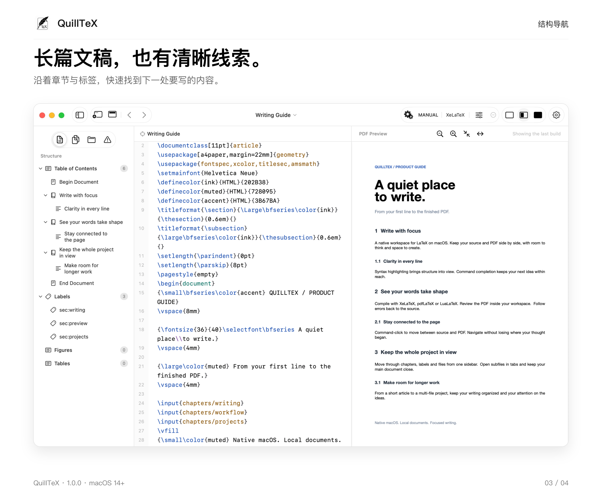
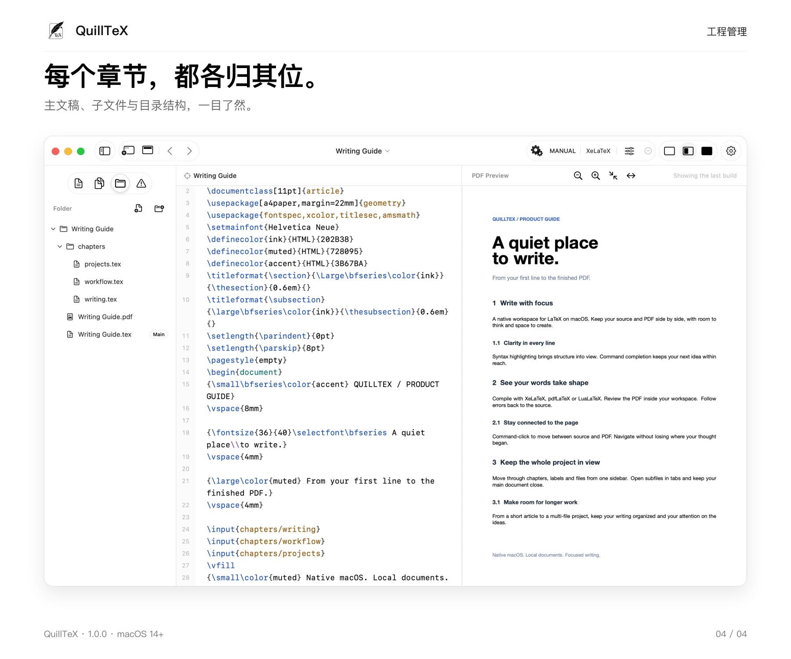

<p align="center">
  
</p>

# QuillTeX

一个克制的原生 macOS LaTeX 编辑器，让源码、工程结构与 PDF 成稿在同一个工作区中保持联系。

**Version 1.0.1** · macOS 14+ · Apple Silicon

[下载 1.0.1](https://github.com/YoungDrifter/QuillTeX/releases/tag/v1.0.1)









## 功能

- 本地文稿库、最近打开与模板，支持多标签编辑和多文件工程。
- 章节、标签和图表导航，帮助定位长篇文稿与子文件。
- LaTeX 语法高亮及命令、环境、标签和引用键补全。
- 使用 XeLaTeX、pdfLaTeX 或 LuaLaTeX 本地编译，点击诊断跳转到对应源码。
- 源码与 PDF 并排显示，支持缩放、页面适配及 ⌘-点击双向定位。
- 独立标签栏可按需显示或隐藏；点击顶栏文件名可重命名并设置 Finder 标签。
- 切换主文件时同步工程、编译目标与预览；自动编译期间继续显示已有 PDF。
- 从 Finder 打开 `.tex` 文件，识别 `% !TeX root = ...`；支持在工程中切换主文件。
- 统一的分类设置界面，包含编译配置、自动构建、插件入口与应用信息。
- 每天自动检查 GitHub 正式版；有更新时在应用内提示、下载并安装，也可从应用菜单或 About 手动检查。

## 安装

从 [Releases](https://github.com/YoungDrifter/QuillTeX/releases/tag/v1.0.1) 下载 `QuillTeX-1.0.1.dmg`，打开后将 **QuillTeX.app** 拖入 **Applications**。`SHA256SUMS.txt` 提供安装包校验值。

当前版本使用 ad-hoc 签名，尚未经过 Apple 公证。

编译文稿需要本机安装 TeX（MacTeX / TeX Live）；未安装时仍可编辑与导航。

## 版本记录

### 1.0.0 · 首次发布

首次发布，支持文稿管理、多文件工程、独立标签栏、LaTeX 编辑与补全、主文件管理、本地编译、PDF 预览和双向定位。

[版本介绍与演示](docs/versions/1.0.0/README.md) · [下载 1.0.0](https://github.com/YoungDrifter/QuillTeX/releases/tag/v1.0.0)

### 1.0.1 · 侧栏交互调整

所有侧栏层级默认折叠，优化展开交互；补全框支持限高滚动与鼠标选择，编辑区提供撤销／重做按钮与快捷键；Manual 模式可选择保存后编译，About 显示版本与构建号。

[更新说明](docs/versions/1.0.1/README.md) · [下载 1.0.1](https://github.com/YoungDrifter/QuillTeX/releases/tag/v1.0.1)

## 本地构建

安装 Xcode 后，在项目根目录运行：

```sh
xcodebuild -project QuillTeX.xcodeproj -scheme QuillTeX -configuration Debug build
```

使用 Xcode 打开 `QuillTeX.xcodeproj` 进行开发。正式安装包由发布脚本生成，并包含校验文件和签名更新清单。

运行 `./Tests/run.sh` 执行自动化测试。

## 许可证

本项目采用 [MIT License](LICENSE)，允许使用、修改、分发和商业使用，请保留版权及许可证声明。软件按原样提供，不附带任何担保。

## 反馈与贡献

欢迎通过 [Issues](https://github.com/YoungDrifter/QuillTeX/issues) 报告问题或提出建议，也欢迎提交 Pull Request。报告问题时请附上 macOS 版本、应用版本和复现步骤；较大的改动请先开 Issue 讨论。

这是个人维护的项目，按作者的时间与需求持续改进，不承诺固定更新频率或响应时间。
