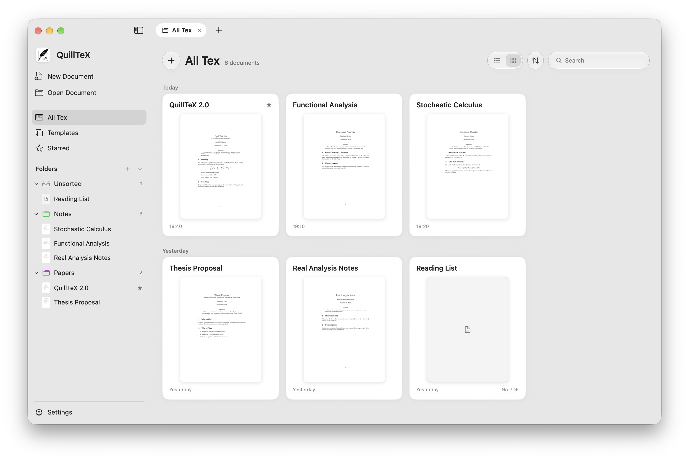
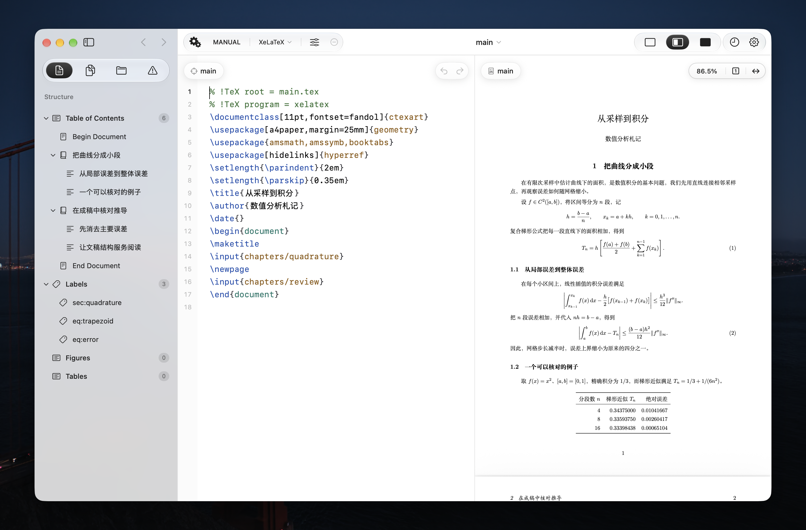

<p align="center">
  
</p>

# QuillTeX

一个克制的原生 macOS LaTeX 编辑器，让源码、工程结构与 PDF 成稿在同一个工作区中保持联系。

**Version 2.0.0** · macOS 14+ · Apple Silicon

[下载 2.0.0](https://github.com/YoungDrifter/QuillTeX/releases/tag/v2.0.0)





## 功能

- 本地文档库自动收录打开的 `.tex`，可按文件夹、Star 和搜索整理；提供列表与 PDF 卡片视图，支持日期属性与排序方向切换，右键可把已编译 PDF 导出到指定目录；文件夹可自定义颜色，新建时选择或通过右键菜单修改。
- All Tex、Starred、Templates 和文件夹都以标签打开；New Tab 页提供新建、打开、模板、Quick Open 与最近文档。
- 文档标签可拖动排序和关闭；All Tex 是临时主页标签，打开文档后折叠回 home 图标，点击即可回到文档库。
- 章节、引用标签、图表和表格导航，帮助定位长篇文稿与子文件。
- LaTeX 语法高亮与内置 Completion：按 Tab 接受行内提示，Option–Esc 打开分类候选，支持分阶段环境补全、工程路径和数学参数跳转。
- Templates 以卡片或列表显示每个模板的内容与日期，可在应用内新建、编辑、重命名和删除，点击即像普通文稿一样编辑，不显示 PDF 预览和编译按钮。
- 新建文档弹窗包含名称、位置与模板三项，默认保存到 `~/Documents/QuillTeX`，并记住上次使用的文件夹；默认新建位置可在设置 → Library 中修改；不选择模板时创建空白文稿。
- 在展开的文件夹中直接新建 TeX 或文件夹，名称在文件行内编辑，回车或点击侧栏空白处保存，留空使用默认名，右键可重命名或移到废纸篓。
- 使用 XeLaTeX、pdfLaTeX 或 LuaLaTeX 本地编译，点击诊断跳转到对应源码。
- 可折叠的警告／错误列表与排版校对，帮助检查错误、溢出行和未解析引用。
- 源码与 PDF 并排显示，支持手势缩放、Actual Size、适应宽度和实时缩放比例，以及 ⌘-点击双向定位。
- TeX Project 是内置功能：按 Main、Sub、Others 管理工程关系，可拖动文件增删 `% !TeX root = …` 注释，已有主文件注释仍会被识别。
- 重新打开工程时恢复上次的文件、编辑位置与 PDF 阅读状态，异常退出前的未保存编辑也会保留。
- TeX 与 PDF 跟随外部保存自动刷新；存在未保存的 TeX 编辑时，可选择保留当前编辑或采用外部版本。
- 设置以标签打开；侧栏第 2 页显示编译配置、自动构建与 Library 分类，以及应用版本。
- 每天自动检查 GitHub 正式版；有更新时在应用内提示、下载并安装，也可从应用菜单手动检查。

## 安装

从 [Releases](https://github.com/YoungDrifter/QuillTeX/releases/tag/v2.0.0) 下载 `QuillTeX-2.0.0.dmg`，打开后将 **QuillTeX.app** 拖入 **Applications**。`SHA256SUMS.txt` 提供安装包校验值。

当前版本使用 ad-hoc 签名，尚未经过 Apple 公证。

编译文稿需要本机安装 TeX（MacTeX / TeX Live）；未安装时仍可编辑与导航。

## 版本记录

### 1.0.0 · 首次发布

首次发布，支持文稿管理、多文件工程、多标签编辑、LaTeX 编辑与补全、主文件管理、本地编译、PDF 预览和双向定位。

[版本介绍](docs/versions/1.0.0/README.md) · [下载 1.0.0](https://github.com/YoungDrifter/QuillTeX/releases/tag/v1.0.0)

### 1.0.1 · 侧栏交互调整

所有侧栏层级默认折叠，优化展开交互；补全框支持限高滚动与鼠标选择，编辑区提供撤销／重做按钮与快捷键；Manual 模式可选择保存后编译，About 显示版本与构建号。

[更新说明](docs/versions/1.0.1/README.md) · [下载 1.0.1](https://github.com/YoungDrifter/QuillTeX/releases/tag/v1.0.1)

### 1.0.2 · 界面统一与最近项目

统一顶栏、标签栏、侧栏与所有弹层的配色、圆角与描边，图标按钮改为一致的圆形点击区；顶栏新增历史记录入口，可直接切换到最近项目；打开文稿改用居中的加号图标，分栏图标改为右侧填充；修复连续点击顶栏按钮边缘误触发窗口放大的问题。

[更新说明](docs/versions/1.0.2/README.md) · [下载 1.0.2](https://github.com/YoungDrifter/QuillTeX/releases/tag/v1.0.2)

### 1.0.3 · 写作与校对优化

优化补全与数学参数输入、长文稿分析、编译诊断与 Result 列表；恢复工程编辑与阅读状态，完善 PDF 定位反馈与排版校对。所有改进直接作为基础功能提供。

[更新说明](docs/versions/1.0.3/README.md) · [下载 1.0.3](https://github.com/YoungDrifter/QuillTeX/releases/tag/v1.0.3)

### 1.1.0 · 写作与交互焕新

跟随输入的行内补全、完整的环境与括号配对、自定义命令优先匹配；可折叠的警告与错误列表；玻璃胶囊分组、统一的滑动选择与悬停反馈，以及对齐的编译设置与策略抽屉。支持子文件标签拖动排序、PDF 实际大小与实时缩放比例，修复导入模板被移出模板库的问题。

[版本介绍](docs/versions/1.1.0/README.md) · [下载 1.1.0](https://github.com/YoungDrifter/QuillTeX/releases/tag/v1.1.0)

### 1.1.1 · 编辑体验优化

空白模板为零内容，内置模板文件统一英文命名；改善连续输入、长文稿光标定位与缩进体验，括号和结束环境按 Tab 接受；Subfiles 可独立开关，侧栏胶囊随模式数量重新排列；统一 PDF 缩放组合按钮，精简弹窗说明，并修正窗口按钮悬停区域与文件夹排序。

[更新说明](docs/versions/1.1.1/README.md) · [下载 1.1.1](https://github.com/YoungDrifter/QuillTeX/releases/tag/v1.1.1)

### 1.1.2 · 插件设置与补全优化

插件提供独立设置页，补全可分类配置；Option–Esc 打开候选列表，支持工程内文件路径，环境按命令、名称与结束部分逐步确认，各步可单独撤销。

[更新说明](docs/versions/1.1.2/README.md) · [下载 1.1.2](https://github.com/YoungDrifter/QuillTeX/releases/tag/v1.1.2)

### 1.1.3 · TeX 工程与工作区调整

TeX Project 按 Main、Sub、Others 管理文件关系并支持拖动增删主文件注释，关闭插件后当前 TeX 文件直接成为编译目标，移除标签栏并为侧栏采用独立浅灰色调，内容顶栏收紧且编译入口前置，编辑与预览顶栏使用内容自适应的悬浮胶囊并提供随正文滚走的顶部白色缓冲留白，PDF 预览移除固定白条和中间编译状态胶囊，默认窗口调整为 1280 × 760 且编辑与预览等宽；编译步骤增加超时保护，顶栏空白处支持系统双击缩放。

[更新说明](docs/versions/1.1.3/README.md) · [下载 1.1.3](https://github.com/YoungDrifter/QuillTeX/releases/tag/v1.1.3)

### 1.2.0 · 写作工作区焕新

集中发布重做后的写作工作区：TeX Project 按 Main、Sub、Others 管理工程文件并支持拖动增删主文件注释，关闭插件后当前 TeX 文件直接成为编译目标；移除标签栏，侧栏贯穿窗口全高并使用浅灰实色；内容顶栏收紧为 46 pt，编辑与预览改为内容自适应的悬浮胶囊，预览区 PDF 胶囊与编辑区一致使用可点击的面包屑路径并以图标区分，编辑区顶部白色留白随正文滚走，PDF 预览默认与面板顶部齐平、向上拉动才弹性露出留白；PDF 预览移除固定白条和中间编译状态胶囊；默认窗口 1280 × 820 且编辑与预览等宽；编译步骤增加超时保护，顶栏空白支持系统双击缩放，编辑区滚动条显示时暂停中间分隔线拖动。

[更新说明](docs/versions/1.2.0/README.md) · [下载 1.2.0](https://github.com/YoungDrifter/QuillTeX/releases/tag/v1.2.0)

### 1.2.1 · 分栏与输出文件修复

打开工程时编辑区与预览区恢复等宽，分栏比例不再随窗口缩放漂移；侧栏/编辑与编辑/预览两条中间分隔线在滚动条显示时暂停拖动，滚动条淡出后恢复。编辑区胶囊显示保存状态（Saved / Unsaved），顶栏文件名去掉未保存圆点；PDF 胶囊显示编译状态与临时提示（Not built yet / Compiling · showing the previous PDF / Build succeeded / Awaiting compilation / Build failed / SyncTeX was not found…，均为英文），胶囊宽度随文字自适应；重命名主 TeX 文件时 PDF 与 aux、log、synctex 等辅助文件同步改名。

[更新说明](docs/versions/1.2.1/README.md) · [下载 1.2.1](https://github.com/YoungDrifter/QuillTeX/releases/tag/v1.2.1)

### 2.0.0 · 文档库与标签化工作区

以本地文档库作为启动主页：自动收录打开的 `.tex`，支持文件夹、Star、搜索、文件夹颜色、列表与 PDF 卡片视图、日期属性与排序方向切换，并可右键导出 PDF。All Tex、Starred、Templates 和文件夹以标签打开；All Tex 是临时主页标签，关闭最后一个标签会进入 New Tab。标签可拖动排序与关闭；Templates 可在应用内新建与编辑，无 PDF 预览与编译按钮；新建文档不选模板即为空白，并可设置保存位置，默认新建位置可在设置 → Library 中修改。设置改为标签，侧栏第 2 页显示设置分类；Completion 与 TeX Project 转为内置功能，无需单独启用。界面统一按钮、胶囊与卡片的玻璃材质及动画；新建文档、文件夹与确认弹窗改为简洁的浮动卡片。

[更新说明](docs/versions/2.0.0/README.md) · [下载 2.0.0](https://github.com/YoungDrifter/QuillTeX/releases/tag/v2.0.0)

## 本地构建

安装 Xcode 后，在项目根目录运行：

```sh
xcodebuild -project QuillTeX.xcodeproj -scheme QuillTeX -configuration Debug build
```

使用 Xcode 打开 `QuillTeX.xcodeproj` 进行开发。正式安装包由发布脚本生成，并包含校验文件和签名更新清单。

运行 `./Tests/run.sh` 执行自动化测试。

## 许可证

本项目采用 [MIT License](LICENSE)，允许使用、修改、分发和商业使用，请保留版权及许可证声明。软件按原样提供，不附带任何担保。

## 反馈与贡献

欢迎通过 [Issues](https://github.com/YoungDrifter/QuillTeX/issues) 报告问题或提出建议，也欢迎提交 Pull Request。报告问题时请附上 macOS 版本、应用版本和复现步骤；较大的改动请先开 Issue 讨论。

这是个人维护的项目，按作者的时间与需求持续改进，不承诺固定更新频率或响应时间。
